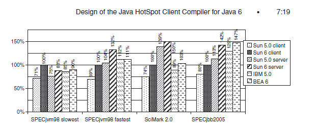
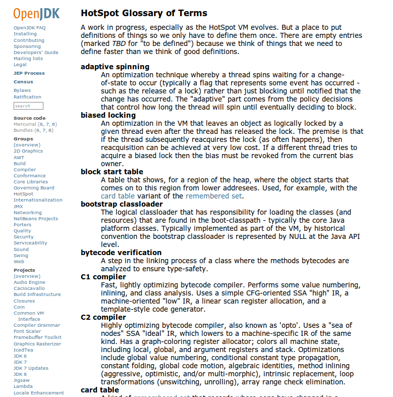
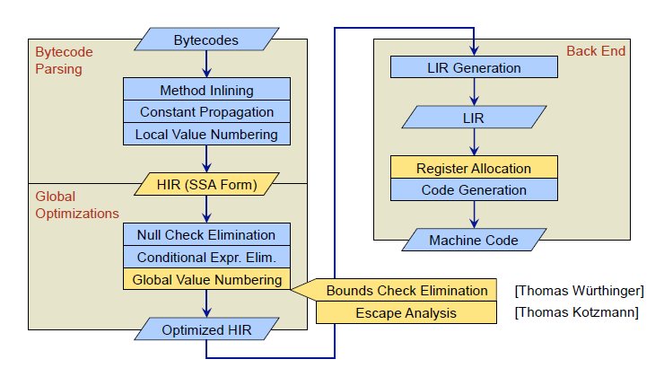

*OpenJDK HotSpot Client Compiler Overview*
###############################################################################

タイトル
===============================================================================
*OpenJDK HotSpot Client Compiler Overview*

第4回JVMソースコードリーディングの会

nothingcosmos<nothingcosmos@gmail.com>

http://nothingcosmos.blog52.fc2.com/

http://nothingcosmos.wiki.fc2.com/

自己紹介
===============================================================================
HN:nothingcosmos

昔コンパイラ部署に所属していたソフトウェアエンジニア

コンパイラ部署時の経験をいかしてC1コンパイラを読んで発表しました。

OpenJDK キーワード
===============================================================================

* HotSpotコンパイラ

* C1(Client)/C2(Server)コンパイラ

* JIT

* Adaptive Compilation

  * Deoptimize 脱最適化

* 中間表現/中間言語

HotSpotの見どころ1
===============================================================================

一般ユーザからみたコンパイラの見どころ

* ...

Scalaユーザからみたコンパイラの見どころ

* Scalaでは細かいオブジェクトをたくさん作るので、
  EscapeAnalysisがあると全部レジスタやスタックに乗る

  という話を以前kmizuさんに聞いた記憶が...

  毎回ヒープに割り付けないので、高速

HotSpotの見どころ2
===============================================================================

私個人は、

* コンパイラ内部の中間言語構造とアーキテクチャ

* 大した最適化してないのに速いコードを吐くHotSpot Client Compiler

* 適応的コンパイル Adaptive Compilation

  * JITコンパイラ/脱最適化のコントロール
  * Profiling/Tracingの取得方法と活用方法

* HotSpot特有の最適化技術

  * EscapeAnalysis/ClassHierarchyAnalysis
  * 複数アーキテクチャへの対応方法
  * OpenJDK7の最適化のバグ

本日紹介するC1 Compiler
===============================================================================

OpenJDKのHotSpot Glossary of Termsより抜粋 ::

  Fast, lightly optimizing bytecode compiler.
  Performs some value numbering, inlining, and class analysis.
  Uses a simple CFG-oriented SSA "high" IR, a machine-oriented "low" IR,
  a linear scan register allocation, and a template-style code generator.

* ValueNumbering

 * 値番号付けというSSA形式を利用した最適化のアルゴリズムの名前.
   冗長な式を削除する

* inlining

  * インライン展開

* class analysis

  * CHA(ClassHierachyAnalysis).
    クラス解析 仮想関数呼出の呼び出し先を特定する際に活躍する

* CFG-oriented SSA

  * CFG ControlFlowGraph

  * SSA StaticSingleAssignment form

* IR

  * Intermediate Representation
    コンパイラ独自の中間表現

* linear scan register allocation

  * リニアスキャンというレジスタ割り付けのアルゴリズム

* template-style code generator

  * asmの生成はあまり頑張らない。LIRからシーケンシャルに生成

C1コンパイラの構成
===============================================================================

hotspot/src/share/vm

* c1         <-- C1コンパイラの本体

* compiler   <-- コンパイラの抽象クラス

* runtime    <-- JVMのruntime部分

hotspot/src/share/vm/c1

C1コンパイラ 全体で36kstep

top5 ::

  c1_LinerScan    7700step  LinerScanでレジスタ割り付け
  c1_LIR          4300step  LIR(Low-Level IRの定義)
  c1_GraphBuilder 4200step  BytecodeからHIRへの変換
  c1_LIRGenerator 3500step  HIRからLIRへの変換
  c1_Instruction  3300step  HIR(High-Level IR)の定義

vm/c1/* ::

  c1_CFGPrinter.cpp           <-- -XX:+PrintCFGToFile オプションを指定時、
  c1_CFGPrinter.hpp               中間表現のHIRやLIRをxmlで出力。c1visualizerで解析する
  c1_Canonicalizer.cpp        <-- HIRへ変換する際に正規化する
  c1_Canonicalizer.hpp            c1_GraphBuilderから呼ばれる
  c1_CodeStubs.hpp            <-- LIRやAssemblerで挿入される、JVMのciXX/runtime向けのStub
  c1_Compilation.cpp          <-- C1コンパイラのコントローラー Driver???
  c1_Compilation.hpp
  c1_Compiler.cpp             <-- C1コンパイラの本体
  c1_Compiler.hpp
  c1_Defs.cpp                 <-- architecture依存の各種定義ファイル レジスタとか
  c1_Defs.hpp
  c1_FpuStackSim.hpp          <-- architecture依存のFPUStackのシミュレータの定義ファイル
  c1_FrameMap.cpp             <-- architecture依存のFrameMapや仮想レジスタやCallingConvension
  c1_FrameMap.hpp
  c1_GraphBuilder.cpp         <-- BytecodeからHIRへの変換
  c1_GraphBuilder.hpp             各種最適化も行う(inlining, devirtualize, canonicalize
  c1_IR.cpp                   <-- IRの定義
  c1_IR.hpp                       HIR/LIR/BB/各種helperを統合したIRという名のDescripter
  c1_Instruction.cpp          <-- HIRの定義や、IRクラスのUtility
  c1_Instruction.hpp
  c1_InstructionPrinter.cpp   <-- HIRのprinter 見やすいように情報を絞って整形して表示する
  c1_InstructionPrinter.hpp
  c1_LIR.cpp                  <-- LIRの定義
  c1_LIR.hpp
  c1_LIRAssembler.cpp         <-- LIRからAsmのemitter兼helper Asmのコード生成
  c1_LIRAssembler.hpp
  c1_LIRGenerator.cpp         <-- HIRからLIRへの変換
  c1_LIRGenerator.hpp             命令選択、レジスタ割り付け、LIRレベルの最適化も行う。
  c1_LinearScan.cpp           <-- LinearScanレジスタ割り付け
  c1_LinearScan.hpp
  c1_MacroAssembler.hpp       <-- architecture依存のAsm出力用マクロ(Assember向けpsuedo code)
  c1_Optimizer.cpp            <-- HIR向け各種最適化 Eliminate (const expr|blocks|null checks)
  c1_Optimizer.hpp
  c1_Runtime1.cpp             <-- C1コンパイラのRuntime JVM本体のruntimeとの橋渡し
  c1_Runtime1.hpp
  c1_ValueMap.cpp             <-- HIR向け最適化 ValueNumberingの本体
  c1_ValueMap.hpp
  c1_ValueSet.cpp             <-- HIR向けADT @todo
  c1_ValueSet.hpp
  c1_ValueStack.cpp           <-- HIR向けADT @todo
  c1_ValueStack.hpp
  c1_ValueType.cpp            <-- C1コンパイラ内部のIR向け型定義
  c1_ValueType.hpp
  c1_globals.cpp              <-- C1コンパイラ向けのオプション定義
  c1_globals.hpp

※  architecture依存と書いたものは、hotspot/src/cpu/XXX/vm の下に本体がいる。

※  architectureは、x86_32/x86_64 sparc zero がある
