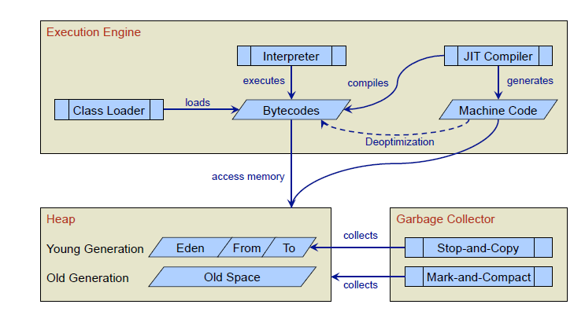
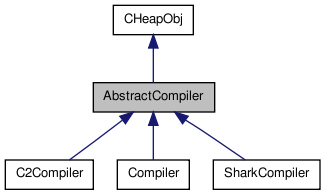
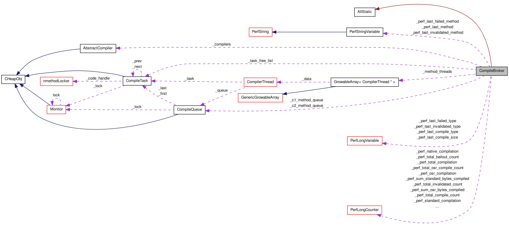

コンパイル前の動作
###############################################################################

JITコンパイラ
===============================================================================

JVMは、最初bytecodeをclassloaderが呼び出した後、インタプリタ実行を行う。

インタプリタ実行中にプロファイルを行い、条件を満たしたらJITコンパイルする

JITコンパイルは、コンパイラの抽象クラス経由で操作する。
コンパイラクラスは3種類ある.

C1/C2/Shark

C1コンパイラ

  -clientオプション指定時のコンパイラ

  コンパイル時間が短く、メモリ使用量もそこそこ。
  大した最適化をしない割にそこそこ高速に動作するコードを生成するのが特徴

  JVM間の比較では、ベンチマーク結果がそこそこ高い。

C2コンパイラ

  -serverオプション指定時のコンパイラ。今回は扱わない。

  コンパイル時間はそこそこ長く、C1より高速に動作するコードを生成する。
  また、コンパイル時のメモリも大きく消費する。

  詳細は、vm/opto参照。C1とは中間言語が異なり、Idealと呼ばれる中間言語。

Sharkコンパイラ

  使い方はまだちゃんと調べてない。

  LLVMと連携してJITコンパイルを行う.
  JITコンパイラをC1/C2ではなく、LLVMを使うということ。JVMの制御はそのまま。

  Sharkは、method単位でBytecodeをBitcodeに変換したのち、
  LLVMに渡してJITコンパイルする。

  LLVMにBitcodeを渡す際に何も小細工しないので、脱仮想化とかEscapeAnalysisとかさっぱり
  LLVMのBitcodeにMetadataを埋め込んで、
  (たとえば、このcallはこのメソッドに脱仮想化候補だとか、allocaはstack/register割り付け可能だとか)
  LLVMのJITコンパイラ起動時、上記metadata用最適化パスをオプションで渡せば連携できるはず。

  いろいろと夢広がる。
  現在は、対応アーキテクチャを増やすために使っている
  ex) ARM PowerPC PTX CBackend

  LLVM 3.0 のReleaseNoteから、Sharkの連携やIcedTeaとの連携のことがかかれているので、
  興味があるかたはLLVMのページへ

JITコンパイラが呼ばれる仕組み
===============================================================================

compileBrokerがJITコンパイラを生成し、メソッド単位でコンパイルする

compiler::compile_method() ::

  compileBroker
    compiler/abstructCompiler
      compile_method(ciEnv*, ciMethod*, int entry_bci)

条件を満たしたときにJITコンパイラを生成し、メソッド単位でJITコンパイルを行う。

* 条件を満たしたときに ... vm/runtime/compilationPolicy

* JITコンパイラを生成  ... vm/compiler/compileBroker

JITコンパイラは、JVMがメモリを確保して、別スレッドでコンパイルブローカーに処理を移譲する。

JVMTIを使うので、スレッドが切れていて、処理が追いにくい。

また、スレッド並列で、インタプリタと並行してJITコンパイルは走るが、

-Xbatchオプションを指定すると、JITコンパイル中にインタプリタ実行を停止することができる。

compileBroker::compilation_init() ::

  // ------------------------------------------------------------------
  // CompileBroker::compilation_init
  //
  // Initialize the Compilation object
  void CompileBroker::compilation_init() {
    _last_method_compiled[0] = '\0';

  #ifndef SHARK
    // Set the interface to the current compiler(s).
    int c1_count = CompilationPolicy::policy()->compiler_count(CompLevel_simple);
    int c2_count = CompilationPolicy::policy()->compiler_count(CompLevel_full_optimization);
  #ifdef COMPILER1
    if (c1_count > 0) {
      _compilers[0] = new Compiler();
    }
  #endif // COMPILER1

  #ifdef COMPILER2
    if (c2_count > 0) {
      _compilers[1] = new C2Compiler();
    }
  #endif // COMPILER2

  #else // SHARK
    int c1_count = 0;
    int c2_count = 1;

    _compilers[1] = new SharkCompiler();
  #endif // SHARK

JITコンパイルの入出力
===============================================================================

JVMのJITコンパイラは、ciMethodクラスが入力

compiler::compile_method() ::

  compiler/abstructCompiler
    compile_method(ciEnv*, ciMethod*, int entry_bci)

JITコンパイラの出力の形式は複数存在する。

* method->codeの書き換え

* もし書き換え対象のメソッドを今実行中だったら。。。

JITコンパイルの入り口のメソッド

CompileBroker::compile_method_base() ::

  void CompileBroker::compile_method_base(methodHandle method,
                                          int osr_bci,
                                          int comp_level,
                                          methodHandle hot_method,
                                          int hot_count,
                                          const char* comment,
                                          TRAPS) {

JITコンパイルする条件
===============================================================================
JVMのインタプリタ実行中にprofileを行い、
下記に示すカウンタをカウントアップする。

* invocation count

  * メソッドの呼び出し回数をカウント

* backward branch count

  * ループの実行回数をカウント

invocation countのカウントアップ::

  bytecodeInterpreter.cpp::BytecodeInterpreter::run()

  case method_entry: {
    THREAD->set_do_not_unlock();
    // count invocations
    assert(initialized, "Interpreter not initialized");
    if (_compiling) {
      if (ProfileInterpreter) {
        METHOD->increment_interpreter_invocation_count();
      }
      INCR_INVOCATION_COUNT;
      if (INVOCATION_COUNT->reached_InvocationLimit()) {
        CALL_VM((void)InterpreterRuntime::frequency_counter_overflow(THREAD, NULL), handle_exception);

        // We no longer retry on a counter overflow

        // istate->set_msg(retry_method);
        // THREAD->clr_do_not_unlock();
        // return;
      }
      SAFEPOINT;
    }

    if ((istate->_stack_base - istate->_stack_limit) != istate->method()->max_stack() + 1) {
      // initialize
      os::breakpoint();
    }

//memo frequency_counter_overflowでJITコンパイラを呼ぶはず

backward branch countのカウントアップ ::

    CASE(_goto):
    {
      int16_t offset = (int16_t)Bytes::get_Java_u2(pc + 1);
      address branch_pc = pc;
      UPDATE_PC(offset);
      DO_BACKEDGE_CHECKS(offset, branch_pc);
      CONTINUE;
    }

    CASE(_goto_w):
    {
      int32_t offset = Bytes::get_Java_u4(pc + 1);
      address branch_pc = pc;
      UPDATE_PC(offset);
      DO_BACKEDGE_CHECKS(offset, branch_pc);
      CONTINUE;
    }

    #define DO_BACKEDGE_CHECKS(skip, branch_pc)                                                         \
    if ((skip) <= 0) {                                                                              \
      if (UseLoopCounter) {                                                                         \
        bool do_OSR = UseOnStackReplacement;                                                        \
        BACKEDGE_COUNT->increment();                                                                \
        if (do_OSR) do_OSR = BACKEDGE_COUNT->reached_InvocationLimit();                             \
        if (do_OSR) {                                                                               \
          nmethod*  osr_nmethod;                                                                    \
          OSR_REQUEST(osr_nmethod, branch_pc);                                                      \
          if (osr_nmethod != NULL && osr_nmethod->osr_entry_bci() != InvalidOSREntryBci) {          \
            intptr_t* buf = SharedRuntime::OSR_migration_begin(THREAD);                             \
            istate->set_msg(do_osr);                                                                \
            istate->set_osr_buf((address)buf);                                                      \
            istate->set_osr_entry(osr_nmethod->osr_entry());                                        \
            return;                                                                                 \
          }                                                                                         \
        }                                                                                           \
      }  /* UseCompiler ... */                                                                      \
      INCR_INVOCATION_COUNT;                                                                        \
      SAFEPOINT;                                                                                    \
    }

インタプリタがprofileのカウンタを更新する様子

gdb stack trace ::

  Breakpoint 5, NonTieredCompPolicy::reset_counter_for_invocation_event (this=0x807a738, m=...)
    at /home/elise/language/openjdk6/hotspot/src/share/vm/runtime/compilationPolicy.cpp:189
    189   m->invocation_counter()->set_carry();
    (gdb) up
  #1  0x004cbdd5 in SimpleCompPolicy::method_invocation_event (this=0x807a738, m=..., __the_thread__=0x806d000)
    at /home/elise/language/openjdk6/hotspot/src/share/vm/runtime/compilationPolicy.cpp:394
    394   reset_counter_for_invocation_event(m);
    (gdb) 
  #2  0x004cba19 in NonTieredCompPolicy::event (this=0x807a738, method=..., inlinee=..., branch_bci=-1, bci=-1, 
    comp_level=CompLevel_none, __the_thread__=0x806d000)
    at /home/elise/language/openjdk6/hotspot/src/share/vm/runtime/compilationPolicy.cpp:323
    323       method_invocation_event(method, CHECK_NULL);
    (gdb) 
  #3  0x005dafd2 in InterpreterRuntime::frequency_counter_overflow_inner (thread=0x806d000, branch_bcp=0x0)
    at /home/elise/language/openjdk6/hotspot/src/share/vm/interpreter/interpreterRuntime.cpp:854
    854   nmethod* osr_nm = CompilationPolicy::policy()->event(method, method, branch_bci, bci, CompLevel_none, thread);
    (gdb) 
  #4  0x005daced in InterpreterRuntime::frequency_counter_overflow (thread=0x806d000, branch_bcp=0x0)
    at /home/elise/language/openjdk6/hotspot/src/share/vm/interpreter/interpreterRuntime.cpp:826
    826   nmethod* nm = frequency_counter_overflow_inner(thread, branch_bcp);
    (gdb) 
  #5  0xb5fef92c in ?? ()
    (gdb) 

//interpreterのgoto命令実行時にカウントアップ

//memo OSR_REQESTマクロの中で、frequency_counter_overflow()を呼び出し

JITコンパイラが呼ばれるのは、2つのケース

対象のメソッドの呼び出し回数が規定回数以上になった場合

* 通常のJITコンパイル。メソッド単位でJITコンパイルする。

  次回呼ばれた際にインタプリタではなく、JITコンパイルしたコードを実行する

対象のループのバックエッジの通過回数が規定回数以上になった場合

* 現在実行中のメソッドをJITコンパイルする。

  現在実行中のメソッドなので、インタプリタからJITしたコードへ遷移するのが難しい

  インタプリタ実行中からJITしたコードへ遷移する技術をOnStackReplacementと呼ぶ。

  おもにsafepointを設けて(分岐の前や、分岐の集合地点)

  インタプリタ実行中のFrameとJITコンパイルしたコードのFrameを記録、計算し、

  遷移できるようにテーブルを作成するはず

//OnStackReplacementは、runtime/sharedRuntime.cpp::SharedRuntime::OSR_migration_begin()

//詳細は"コンパイラとバーチャルマシン"っていう書籍が図入りで説明している

JITコンパイルする際のしきい値
===============================================================================

JITコンパイルのしきい値は、clientコンパイラの場合、2000回, serverコンパイラの場合、15000回のはず。

JITコンパイルのしきい値は、CompLevel で計算方法が異なるらしい

CompLevel_simple or CompLevel_full_optimization or CompLevel_limited_profile or CompLevel_full_profile

オプション:

* -XX:CompileThreshold=xxx

デフォルト:

* Tier3CompileThreshold  2000

* Tier4CompileThreshold 15000

compile_methodが呼ばれた際のstack trace

gdb stack trace ::

  // topからdownしていきます
  #6  0xb5fef92c in ?? ()  <-- template intepreter経由なのでこれ以上終えない
    (gdb) down
  #5  0x005daced in InterpreterRuntime::frequency_counter_overflow (thread=0x806d000, branch_bcp=0x0)
    at /home/elise/language/openjdk6/hotspot/src/share/vm/interpreter/interpreterRuntime.cpp:826
    826   nmethod* nm = frequency_counter_overflow_inner(thread, branch_bcp);
    (gdb) 
  #4  0x005dafd2 in InterpreterRuntime::frequency_counter_overflow_inner (thread=0x806d000, branch_bcp=0x0)
    at /home/elise/language/openjdk6/hotspot/src/share/vm/interpreter/interpreterRuntime.cpp:854
    854   nmethod* osr_nm = CompilationPolicy::policy()->event(method, method, branch_bci, bci, CompLevel_none, thread);
    (gdb) 
  #3  0x004cba19 in NonTieredCompPolicy::event (this=0x807a738, method=..., inlinee=..., branch_bci=-1, bci=-1, 
    comp_level=CompLevel_none, __the_thread__=0x806d000)
    at /home/elise/language/openjdk6/hotspot/src/share/vm/runtime/compilationPolicy.cpp:323
    323       method_invocation_event(method, CHECK_NULL);
    (gdb) 
  #2  0x004cbe50 in SimpleCompPolicy::method_invocation_event (this=0x807a738, m=..., __the_thread__=0x806d000)
    at /home/elise/language/openjdk6/hotspot/src/share/vm/runtime/compilationPolicy.cpp:402
    402                                     m, hot_count, comment, CHECK);
    (gdb) 
  #1  0x004cf34e in CompileBroker::compile_method (method=..., osr_bci=-1, comp_level=1, hot_method=..., hot_count=166, 
    comment=0x94b7f6 "count", __the_thread__=0x806d000)
    at /home/elise/language/openjdk6/hotspot/src/share/vm/compiler/compileBroker.cpp:1084
    1084      compile_method_base(method, osr_bci, comp_level, hot_method, hot_count, comment, CHECK_0);
    (gdb) 
  #0  CompileBroker::compile_method_base (method=..., osr_bci=-1, comp_level=1, hot_method=..., hot_count=166, 
    comment=0x94b7f6 "count", __the_thread__=0x806d000)
    at /home/elise/language/openjdk6/hotspot/src/share/vm/compiler/compileBroker.cpp:840
    840   if (!_initialized ) {

InterpreterInvocationLimitとInterpreterBackwardBranchLimitの設定 ::

      void InvocationCounter::reinitialize(bool delay_overflow) {
        // define states
        guarantee((int)number_of_states <= (int)state_limit, "adjust number_of_state_bits");
        def(wait_for_nothing, 0, do_nothing);
        if (delay_overflow) {
          def(wait_for_compile, 0, do_decay);
        } else {
          def(wait_for_compile, 0, dummy_invocation_counter_overflow);
        }

        InterpreterInvocationLimit = CompileThreshold << number_of_noncount_bits;
        InterpreterProfileLimit = ((CompileThreshold * InterpreterProfilePercentage) / 100)<< number_of_noncount_bits;

        // When methodData is collected, the backward branch limit is compared against a
        // methodData counter, rather than an InvocationCounter.  In the former case, we
        // don't need the shift by number_of_noncount_bits, but we do need to adjust
        // the factor by which we scale the threshold.
        if (ProfileInterpreter) {
          InterpreterBackwardBranchLimit = (CompileThreshold * (OnStackReplacePercentage - InterpreterProfilePercentage)) / 100;
        } else {
          InterpreterBackwardBranchLimit = ((CompileThreshold * OnStackReplacePercentage) / 100) << number_of_noncount_bits;
        }

ちなみに、clientの場合

InterpreterInvocationLimit = 12000

InterpreterBackwardBranchLimit = 111960

serverの場合

InterpreterInvocationLimit = 80000

InterpreterBackwardBranchLimit = 10700

clientコンパイラのしきい値って、メソッド呼び出しが1500回で、OnStackReplacementが14000回じゃないの？
